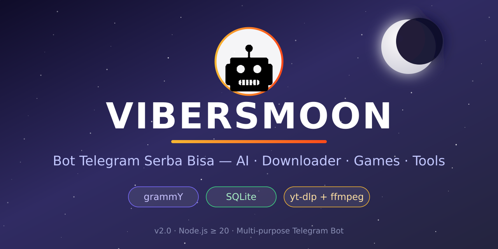

<div align="center">



# 🌙 Vibersmoon

**Bot Telegram serba bisa — AI, vision, cuaca, reminder, downloader, game, catatan & grup.**

Asisten pribadi yang jalan 24/7 di chat kamu. Ketik bebas → dijawab AI. Kirim foto → dibaca AI-nya. Kirim link → langsung diunduh.

[](https://nodejs.org)
[](https://grammy.dev)
[](https://github.com/WiseLibs/better-sqlite3)
[](tests/)
[](#-lisensi)

[✨ Fitur](#-fitur) · [🚀 Quick Start](#-quick-start) · [📖 Perintah](#-daftar-perintah) · [⚙️ Konfigurasi](#️-konfigurasi) · [🏗 Struktur](#-struktur)

</div>

---

<p align="center">
  
</p>

## ✨ Fitur

<table>
<tr><td width="50%">

### 🧠 AI
- **Chat bebas** — semua teks dijawab AI, histori per user
- **Vision AI** — kirim foto, caption = pertanyaanmu
- **Dokumen** — AI baca `.txt`/`.md`/kode lalu jawab
- **`/skills`** — skill siap pakai, mis. `/plan <topik>`

### ⬇️ Downloader
- **`/dl <url>`** — TikTok / YouTube / Instagram
- Deteksi link otomatis (tanpa ketik perintah)
- **`/play`**, **`/yt`**, **`/q <judul>`** — cari & unduh
- Antrean bounded (`p-queue`), kuota 20 unduhan/hari

</td><td width="50%">

### 🔧 Utilitas
- **`/cuaca <kota>`** — real-time (OpenWeather)
- **`/reminder <menit> <pesan>`** — tetap jalan walau restart
- **`/musik`** — putar musik lokal dari folder `music/`
- **`/note`** — catatan pribadi tersimpan di SQLite
- **`/scraper`** — metadata halaman publik

### 🎮 Sosial & Admin
- **`/search lagu|video|gambar`** — iTunes / YouTube / DuckDuckGo
- **`/tictactoe`** — main langsung di chat
- **`/broadcast`** **`/stats`** **`/admin`** **`/ban`** — panel admin

</td></tr>
</table>

> Semua fitur eksternal **opsional & anti-crash**: API key kosong? Bot tetap hidup dan memberi pesan yang jelas.

## 🖥 Tampilan Terminal

```text
███████╗███████╗██████╗ ██████╗  █████╗      ██████╗ ██╗███████╗ █████╗
██╔════╝██╔════╝██╔══██╗██╔══██╗██╔══██╗    ██╔══██╗██║██╔════╝██╔══██╗
███████╗█████╗  ██████╔╝██████╔╝███████║    ██████╔╝██║███████╗███████║
╚════██║██╔══╝  ██╔══██╗██╔══██╗██╔══██║    ██╔══██╗██║╚════██║██╔══██║
███████║███████╗██║  ██║██║  ██║██║  ██║    ██║  ██║██║███████║██║  ██║
╚══════╝╚══════╝╚═╝  ╚═╝╚═╝  ╚═╝╚═╝  ╚═╝    ╚═╝  ╚═╝╚═╝╚══════╝╚═╝  ╚═╝

  ╭──────────────────────────────────────────╮
  │  🤖 Bot: @botkamu                        │
  │  📡 Mode: Long polling                   │
  │  👥 Admin: 1                             │
  │                                          │
  │  💬 Chat AI: ✅ Aktif                    │
  │  🧠 Vision AI: ✅ Aktif                  │
  │  🌤 Cuaca: ✅ Aktif                      │
  │  📥 Downloader: ✅ yt-dlp                │
  │  🎵 Musik: 1 file                        │
  │  ⏰ Reminder: 0 dimuat                   │
  ╰──────────────────────────────────────────╯
```

## 🚀 Quick Start

```bash
# 1. Clone
git clone https://github.com/akram-fanz/Vibersmoon.git
cd Vibersmoon

# 2. Install dependency
npm install

# 3. Konfigurasi
cp .env.example .env      # Windows: copy .env.example .env
#    isi BOT_TOKEN (wajib) — token dari @BotFather

# 4. Jalanin
npm start
```

Fitur unduh butuh binari eksternal:

```bash
pip install -U yt-dlp      # atau: npm run update:ytdlp
# ffmpeg: apt install ffmpeg  |  brew install ffmpeg
```

Pencarian lagu/video/gambar (`/search`) **tidak butuh API key sama sekali** 🎉

## 📖 Daftar Perintah

| Perintah | Deskripsi |
|---|---|
| `/start` `/ping` | Sambutan, menu interaktif & cek status |
| `/help` | Daftar perintah (kirim gambar menu) |
| 💬 *chat bebas* | Ngobrol sama AI, histori per user |
| 🖼 *kirim foto (+caption)* | Vision AI analisa gambar |
| 📄 *kirim dokumen teks* | AI baca file lalu jawab pertanyaanmu |
| `/cuaca <kota>` | Cuaca real-time: suhu, kelembapan, angin |
| `/reminder <menit> <pesan>` | Pengingat sekali pakai (tahan restart) |
| `/dl <url>` | Unduh TikTok/YouTube/Instagram |
| `/play` `/yt` `/q <judul>` | Cari & unduh video/audio |
| `/search lagu\|video\|gambar <kata>` | iTunes / YouTube / DuckDuckGo |
| `/musik` | Putar musik lokal dari `music/` |
| `/note` | Catatan pribadi tersimpan |
| `/skills` `/plan <topik>` | Skill AI siap pakai |
| `/tictactoe` | Game Tic-Tac-Toe di chat |
| `/scraper` | Ambil metadata halaman publik |
| `/admin` `/broadcast` `/stats` `/ban` | Panel admin (khusus admin) |

### 🕹 Contoh Pakai

```text
/start                      → menu utama dengan tombol interaktif
halo bot, apa itu nodejs?   → langsung dijawab AI
/cuaca Jakarta              → cuaca Jakarta sekarang
/reminder 30 minum air      → diingatkan 30 menit lagi

/search lagu despacito      → contoh audio bisa diputar + link
/search video tutorial node → daftar video YouTube
/search gambar kucing oren  → galeri gambar + sumbernya

/dl https://vt.tiktok.com/x → unduh video TikTok
kirim foto + caption        → "apa isi gambar ini?" → dijawab AI vision
kirim file catatan.txt      → AI jadi konteks, tinggal bertanya
```

## ⚙️ Konfigurasi (.env)

| Variabel | Wajib | Keterangan |
|---|---|---|
| `BOT_TOKEN` | ✅ | Token bot dari [@BotFather](https://t.me/BotFather) |
| `ADMIN_IDS` | — | ID Telegram admin (pisah koma). Cek via [@userinfobot](https://t.me/userinfobot) |
| `AI_BASE_URL` | ❌ | Endpoint OpenAI-compatible, mis. Groq `https://api.groq.com/openai/v1` |
| `AI_API_KEY` | ❌ | API key layanan AI |
| `AI_MODEL` | ❌ | Model teks, default `gpt-4o-mini` |
| `AI_VISION_MODEL` | ❌ | Model vision untuk foto. Kosong = nonaktif |
| `WEATHER_API_KEY` | ❌ | API key gratis dari [OpenWeatherMap](https://openweathermap.org/api) |
| `YT_DL_API_URL` / `IG_DL_API_URL` | ❌ | Alternatif unduh berbasis API |
| `RATE_LIMIT_MAX` | ❌ | Default `10` request/menit |
| `DOWNLOAD_QUOTA` | ❌ | Default `20` unduhan/hari |

## 🏗 Struktur Project

```text
Vibersmoon/
├─ src/
│  ├─ index.js        # bootstrap: config → db → queue → bot → shutdown
│  ├─ bot.js          # rakit bot & urutan registrasi command
│  ├─ core/           # config, logger, queue, rate limit, temp store
│  ├─ middlewares/    # error boundary, rate limit, session, command log
│  ├─ commands/       # 1 file = 1 fitur (grammY handlers)
│  ├─ services/       # logika bisnis bebas Telegram
│  │   └─ downloader/ # provider: yt-dlp, tiktok, api (interface match/probe/download)
│  └─ utils/          # url guard (SSRF), format, keyboard, safe file
├─ tests/             # node --test
├─ scripts/           # migrate json→sqlite, backup, update-ytdlp
├─ assets/  music/    # gambar menu & audio bawaan
├─ data/              # SQLite bot.db — TIDAK di-commit
└─ tmp/               # job sementara — auto dibersihkan
```

**Prinsip arsitektur:** `commands/` cuma parsing & tampilan; logika bisnis di `services/` yang bebas objek Telegram → gampang dites & nambah fitur.

## 🛡 Keamanan

- Token & API key **hanya** di `.env` — tidak pernah di-commit (diblokir `.gitignore`)
- Guard SSRF: hanya `http(s)`, tolak IP privat/loopback/link-local setelah DNS resolve
- `child_process.spawn` tanpa shell → anti command injection
- Rate limit `10 req/menit` + kuota `20 unduhan/hari` per user
- Error ke chat tanpa stack trace / secret; gambar dikirim ke AI sebagai base64, bukan URL Telegram
- Perintah admin dicek middleware, bukan `if` manual

## 🧪 Testing

```bash
npm test        # node --test tests/*.test.js
```

## 📦 Deploy

Mode default long polling — tanpa domain & SSL. Target deployment (Termux / Docker / VPS+pm2) **belum dikonfigurasi**, menunggu konfirmasi owner.

## 🗺 Roadmap

- [x] Phase 0 — arsitektur, migrasi JSON → SQLite, setup
- [ ] MVP — downloader + inti perintah
- [ ] v1 — scraper publik + games + skor/level
- [ ] v2 — media conversion, TTS, tools grup, ekonomi
- [ ] Multi-bahasa respons
- [ ] To-do list / kalender

## 🤝 Kontribusi

Fork → branch baru (`feat/fiturkeren`) → commit → Pull Request. Tambah command baru: bikin 1 file di `commands/`, 1 service jika perlu, daftarkan di `bot.js` (AI fallback **selalu paling akhir**).

## 📜 Lisensi

MIT — lihat [LICENSE](LICENSE).

---

<div align="center">


</div>
